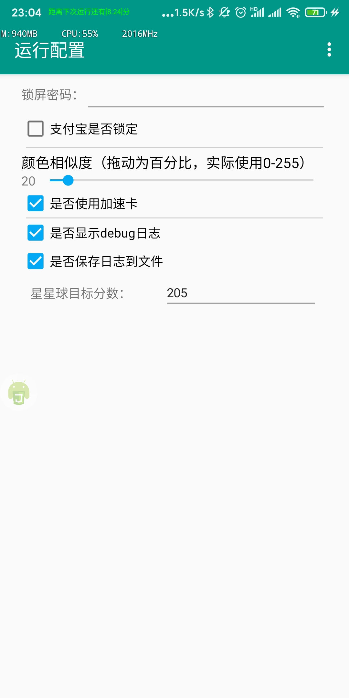

<!--
 * @Author: TonyJiangWJ
 * @Date: 2019-11-27 09:31:06
 * @Last Modified by: TonyJiangWJ
 * @Last Modified time: 2019-12-23 23:13:34
 * @Description: 
 -->
### 蚂蚁庄园自动喂鸡驱赶脚本
- [蚂蚁森林脚本传送门](https://github.com/TonyJiangWJ/Ant-Forest-autoscript)
- 基于AutoJS实现的自动喂养脚本
- 运行config.js 修改配置，设置密码等
- 支持使用加速卡
- AutoJS中手动更新代码。执行`update/检测更新.js`即可 可以选择覆盖更新或者备份后更新 更多说明见`update/说明-重要.txt`
- `星星球`脚本，打开AutoJS悬浮球 然后进入到开始的界面，通过悬浮球菜单打开`星星球.js` 自动开始和小鸡玩，默认达到230分就结束。
- `小鸡登山`脚本正在开发中。。。目前没法正式使用

### 配置
