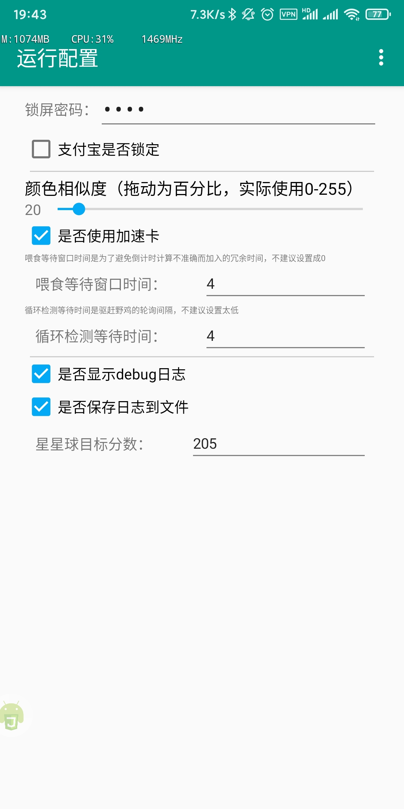

# 蚂蚁庄园自动喂鸡驱赶脚本

- [蚂蚁森林脚本传送门](https://github.com/TonyJiangWJ/Ant-Forest)
- 基于AutoJS实现的自动喂养脚本
- 运行config.js 修改配置，设置密码等
- 支持使用加速卡
- AutoJS中手动更新代码。执行`update/检测更新.js`即可 可以选择覆盖更新或者备份后更新 更多说明见`update/说明-重要.txt`
- `星星球`脚本，打开AutoJS悬浮球 然后进入到开始的界面，通过悬浮球菜单打开`星星球.js` 自动开始和小鸡玩，默认达到230分就结束。
- 支持自定义扩展解锁和配置信息，不会因为更新脚本导致配置丢失
- `小鸡登山`脚本正在开发中。。。目前没法正式使用

## 使用说明

- 下载安装 [AutoJs 4.1.1 alpha2 下载](https://www.dropbox.com/s/pe3w53k0fugo1fa/Autojs%204.1.1%20Alpha2.apk?dl=0) 之后把整个脚本项目放进 **"/sdcard/脚本/"** 文件夹下面。打开软件后下拉刷新，然后运行项目或者 main 即可。
- 给与软件必要权限 `后台弹出界面`、`显示悬浮窗`、`自启动`，并将软件保持后台运行
- 定时启动脚本，点击 `main.js` 的菜单，选择 `更多` `定时任务` 即可配置定时启动
- 如果运行提示有任务正在队列中，请运行配置 `config.js` 然后进到 `进阶配置` 中勾选 `单脚本运行`，该功能是用于多个脚本同时运行时的任务队列 相当于一个调度程序，避免多个脚本抢占前台导致出错
- 不同设备分辨率不同需要自行修改相应配置，在 `extends` 下新建文件 `CustomConfig.js` ，内容参考 `CustomConfig-demo.js` 具体参考文件内的注释说明。demo配置中默认支持分辨率为2160*1080
- 查看具体配置信息可以截图一张自己蚂蚁庄园的图片，放在test目录下，命名为 `蚂蚁庄园截图.jpg` 然后运行 `小鸡界面配置可视化.js` 生成的图片中文字可能看不清，但是可以参考 `CustomConfig-demo.js` 中的注释
- 或者直接运行 `test/全局悬浮窗显示-音量上键关闭.js` 来查看具体位置，不过有可能会导致APP闪退
  

## 配置

- 配置导出导入功能，点击右上角菜单即可导出当前配置到local_config.cfg中，默认已加密加密密码为通过以下方法获取`device.getAndriodId()` 如果需要在免费版和付费版AutoJS之间同步 需要自行获取该值并按提示输入密码
- 运行时数据导出导入功能同上所述



## 添加解锁设备

- 脚本根目录下新建extends文件夹，然后创建ExternalUnlockDevice.js文件，内容格式如下自定义
- 具体可以参考ExternalUnlockDevice-demo.js

```javascript
module.exports = function (obj) {
  this.__proto__ = obj

  this.unlock = function(password) {
    // 此处为自行编写的解锁代码

    // 在结尾返回此语句用于判断是否解锁成功
    return this.check_unlock()
  }

}
```
